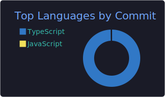
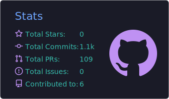
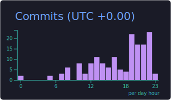
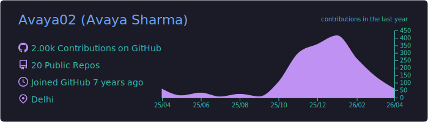

  <h2><code>Hello, my name is Avaya Sharma</code></h2>
  <h3> Full-Stack Developer & AI Solutions Builder </h3>

 

Hi! I am a skilled Full-Stack developer with 1.5 years of experience in building high-performance, data-aware web applications. My expertise in the MERN stack, Next.js, and TypeScript allows me to efficiently handle robust server-side logic and seamless front-end experiences. I am also deeply interested in AI-based technologies, actively integrating LLMs and APIs into web products to optimize systems for Answer Engine Optimization (AEO). My goal is to deliver quality, scalable solutions where software understands data — not just stores it.

 

### 📈 GitHub Activity Graph:

  

 

  <table align="center" style="border: none; background-color: transparent;">
    <tr>
      <td align="center" style="border: none;">
        
      </td>
      <td align="center" style="border: none;">
        
      </td>
    </tr>
    <tr>
      <td align="center" style="border: none;">
        
      </td>
      <td align="center" style="border: none;">
        
      </td>
    </tr>
  </table>

 

  

 

  

 

  <h4>Visitors Count</h4>
  
    
  
<b>Thanks for visiting my profile.</b>

