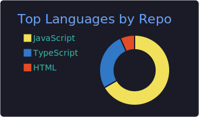

   
  <h1>Avaya Sharma</h1>
  
    

> **System Output:**
> 
> Hi! I am a skilled Full-Stack developer with 1.5 years of experience in building high-performance, data-aware web applications. My expertise in the **MERN stack**, **Next.js**, and **TypeScript** allows me to efficiently handle robust server-side logic and seamless front-end experiences. 
> 
> I am deeply interested in AI-based technologies, actively integrating LLMs and APIs into web products to optimize systems for Answer Engine Optimization (AEO). When I am not building platforms where software understands data, I am sharpening my logic by solving Data Structures and Algorithms problems in **Java** and **C++**.

 

<h3 align="center">⚡ Tech Arsenal</h3>

  

 

<h3 align="center">📈 GitHub Analytics Hub</h3>

  

 

  
  

  
  

 

  

 

  
    
  
  
<code style="color: #7aa2f7;">End of output. Thanks for visiting.</code>

   

